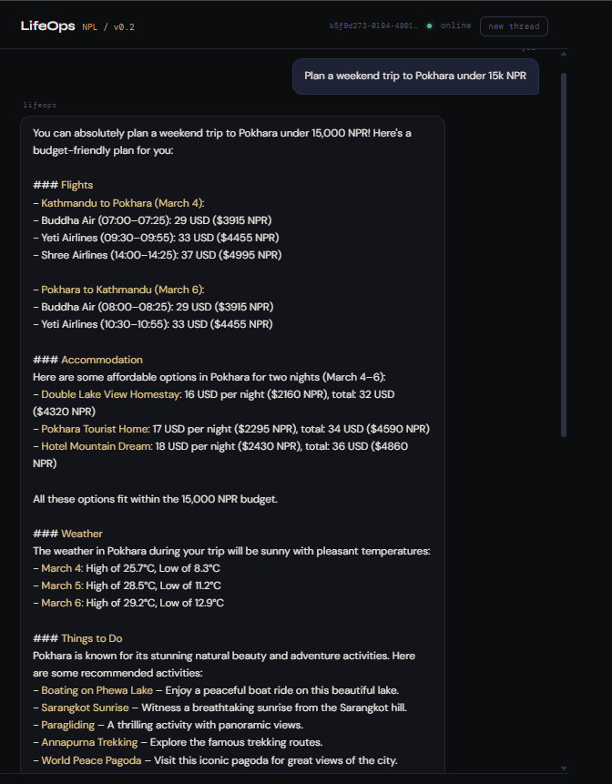
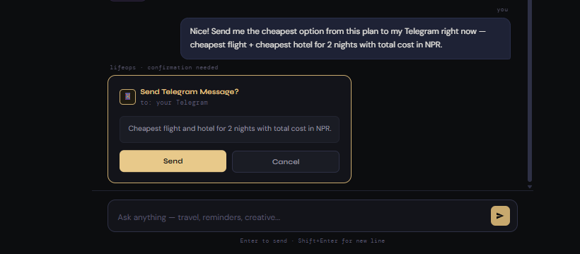
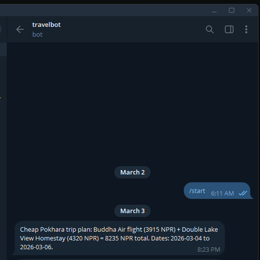

# Demo

Three flows shown below — travel planning, Telegram confirmation, and the delivered message.

> Moodboard generation is working but not included here yet — will add screenshots once the fal.ai setup is back on the primary device.

---

## 1. Travel planning

The user asks for a weekend trip to Pokhara under 15,000 NPR. The travel agent fires four tool calls in parallel — `search_flights` (both directions), `search_hotels`, `get_weather`, and `search_destination_info` — and assembles the response in a single pass.

What's happening under the hood:

- The orchestrator classifies the message as `travel_planning` and routes to the Travel Agent
- qwen3-32b runs a ReAct loop, deciding which tools to call and in what combination
- Flight results come from Sky-Scrapper (Skyscanner data via RapidAPI); hotel results from Booking.com15
- If the live API fails or returns no results, the agent falls back to hardcoded Nepal domestic fare estimates rather than refusing to answer
- All USD prices are converted to NPR (1 USD = 135 NPR) before presenting to the user
- The agent correctly anchors "this weekend" to the actual current date passed in the system prompt, not a hallucinated one

---

## 2. Human-in-the-loop confirmation

After getting the trip plan, the user asks to send the cheapest option to Telegram. The graph hits a LangGraph `interrupt()` before any message is dispatched — the API returns `interrupted: true` and the frontend renders the confirmation card.

The card shows the exact draft that would be sent. The user clicks Send or Cancel. If confirmed, the API resumes the graph with `Command(resume={confirmed: true})` and the message is dispatched. If cancelled, nothing is sent and the graph records the cancellation.

This applies to both the Reminder agent (scheduled or immediate sends) and the Travel agent when explicitly asked to send something. The LLM can compose the draft but cannot fire it unilaterally.

---

## 3. Telegram delivery

The confirmed message arrives in Telegram from the bot — cheapest flight (Buddha Air, 3915 NPR) plus cheapest hotel (Double Lake View Homestay, 4320 NPR for 2 nights) with the total and travel dates.

The Reminder agent also supports scheduled delivery via APScheduler — if the user says "remind me at 8am tomorrow", it extracts the time, asks for confirmation, and schedules the job rather than sending immediately. The reminder content can reference prior context in the thread, so "send me the trip plan" will summarise the actual plan rather than sending a generic message.